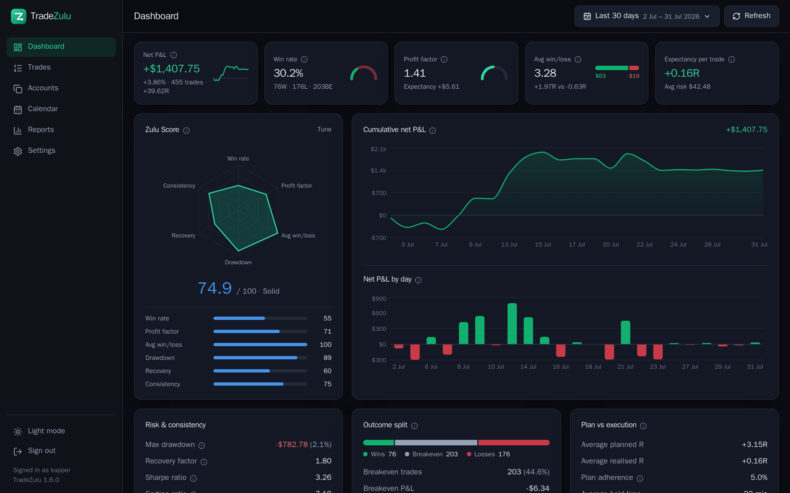

<div align="center">

# TradeZulu

**A trade copier and trading journal for MetaTrader 5, in one.**

Copy trades across any number of accounts under your own risk rules,
and journal every one of them. Self-hosted, free, and yours.

</div>


More screenshots are in [docs/screenshots.md](docs/screenshots.md).

## Quick start

```bash
git clone https://github.com/KasperSkytte/tradezulu.git
cd tradezulu
./install.sh --brokers default,vantage
```

That sets up everything: the site in Docker, and MetaTrader on the host with a
terminal template per broker. It generates your `.env` and prints the login it
made. Open <http://localhost:8420>, sign in, add your account, and a terminal
is started and logged in for it within a minute.

Journal only, no copying or terminals:

```bash
cp .env.example .env      # set TZ_SECRET_KEY and an admin password
docker compose up -d
```

Everything lives in one SQLite file under `./data`.

The admin user is created on the **first** start only, so editing those
variables later has no effect — change the password in Settings, or from
outside if you are locked out:

```bash
docker compose exec tradezulu set-password --username you --password 'a new one'
docker compose exec tradezulu list-users            # if you forgot the name
```

**Just want a look first?** This fills a throwaway database with example trades:

```bash
docker compose run --rm --service-ports -e TZ_DEMO=1 tradezulu demo
```

## Features

**Journal** — Track and improve your performance
 - Synchronize trades from any MetaTrader5 account through a virtual terminal
 - See key statistics for a chosen time period, like win rate, profit factor, average R etc
 - Track your overall performance by a combined "Zulu score" that includes key metrics
 - Understand your mistakes, behavior, and setups by adding tags to individual trades alongside notes
 - See detailed reports about which times of day, setups, tags, etc, that work the best for you
 - Did you follow your plan? See planned vs realised stats in R-multiples

**Copier** — one master account, any number of slaves, any broker.

 - Copy between Metatrader5 accounts, ideal for copying trades across multiple prop-firm funded accounts
 - Sizing that fits each account: fixed lots, a multiplier, the balance or
  equity ratio, or a percentage of the slave's equity risked against the
  master's stop. Lots round *down*, and a size under the broker's minimum is
  refused rather than rounded up into more risk than you allowed.
 - Per-account limits on risk, lot size, open positions, direction, symbol and
  total exposure.
 - Guards that flatten the account and stop copying: equity stop below peak,
  daily drawdown, daily profit target, and prop-firm rules for banking a
  winner and capping one day's share of the profit.
 - Stop and target moves follow through; a close is a close everywhere. Symbol
  differences (`EURUSD`, `EURUSD.r`, `FX_EURUSD`) are resolved per account,
  never guessed.
 - Every slave starts disabled and in dry-run, recording what it *would* have
  done. You arm them one at a time to start copying trades.

## Connect MetaTrader 5

**Accounts → Master account credentials**, three fields:

| Field | Example |
|---|---|
| Trade server | `ICMarketsSC-Live12` |
| Account number | `5000123` |
| Investor password | the read-only one your broker issued |

A MetaTrader terminal is created for the account,
logged in, and given an Expert Advisor that reports back — automatically,
within a minute or so. Nothing to install, no files to copy, no URL to type.

For journaling only, just use the **investor password** for the account instead of the master password: it is read-only, so TradeZulu
cannot trade your account even by accident. Copying to a slave account does
need that account's full password, which is why slaves stay in dry-run until
you arm them.

Terminals are restarted weekly so MetaTrader's updates install during a quiet
hour, rather than a broker's new build stopping a terminal mid-week behind a
dialog nobody is there to answer. Sunday at 3am by default, and adjustable on
the same page — worth changing if you trade crypto through the weekend.

### How that actually works, and why it is a bit of a hack

Worth knowing before you trust it with an account.

There is no API for this. MetaQuotes' server-side APIs are licensed to brokers
running their own MT5 server rather than to the people trading on it, and
priced accordingly — for a business, not for one trader with one account. The
only software that can speak to a broker's MT5 server is MetaTrader itself.

So TradeZulu runs MetaTrader. Each account gets a real terminal on a virtual
display nobody ever looks at, logged in automatically, with an Expert Advisor
inside it reporting every deal back over plain HTTP. One setting cannot be
reached any other way — the terminal keeps its WebRequest allowlist encrypted
in its own config — so the provisioner opens the Options dialog on that
display, measures where it is, and clicks through it.

Clicking buttons on a screen nobody is watching is not elegant. It is made as
honest as it can be: nothing counts as done because a click seemed to land,
only because that account's Expert Advisor actually reached the server; a
terminal that starts but never reports is restarted, then rebuilt, then given
up on loudly rather than left looking healthy. You can watch the display
yourself with `agent/tz-view.sh watch`.

MetaTrader runs on the host rather than in a container, which is also not for
want of trying — [docs/metatrader.md](docs/metatrader.md) covers how the whole
thing is put together and what was ruled out.

## Uninstalling

```bash
./uninstall.sh --dry-run    # print what would happen, change nothing
./uninstall.sh              # remove the software, keep the journal
./uninstall.sh --all        # everything, including Wine and packages
```

The default keeps your trades: the database and the `.env` that decrypts it
survive, so re-running `install.sh` picks up where you left off. `--purge-data`
deletes them and asks you to type DELETE first.

The whole compose stack goes: containers, images and the network, plus the data
volume with `--purge-data`. Anything still carrying the project's label
afterwards — a container from a service this compose file no longer describes,
a volume from an older revision — is removed too, which `docker compose down`
on its own will not do. Containers you started yourself carry no such label and
are never in scope.

MetaTrader prefixes that TradeZulu did not create are never touched, whatever
you pass — only `tz-<account>` and `tz-template-*` are removed, so a terminal
you set up yourself is safe. Wine and Bottles are left alone entirely if any
other bottle is still installed.

## Behind a reverse proxy (nginx example)

TradeZulu binds to `127.0.0.1:8420`, so put nginx in front:

```nginx
server {
    listen 443 ssl;
    server_name trades.example.com;

    ssl_certificate     /etc/letsencrypt/live/trades.example.com/fullchain.pem;
    ssl_certificate_key /etc/letsencrypt/live/trades.example.com/privkey.pem;

    client_max_body_size 25m;

    location / {
        proxy_pass       http://127.0.0.1:8420;
        proxy_set_header Host              $host;
        proxy_set_header X-Forwarded-For   $proxy_add_x_forwarded_for;
        proxy_set_header X-Forwarded-Proto $scheme;
    }
}
```

Set `TZ_COOKIE_SECURE=true` in `.env` so the session cookie is HTTPS-only.
Backups and more in [docs/deployment.md](docs/deployment.md).

## Configuration

Day-to-day settings — risk defaults, breakeven handling, Zulu Score weights,
tags, timezone, currency, theme — are all on the **Settings** page.

`.env` holds only deployment settings:

| Variable | Default | What it does |
|---|---|---|
| `TZ_SECRET_KEY` | *(random)* | Signs the session cookie. Set it, or restarts log you out. |
| `TZ_ADMIN_USER` / `TZ_ADMIN_PASSWORD` | `admin` / — | Created on the first start. |
| `TZ_INGEST_TOKEN` | *(generated)* | Key the terminals authenticate with. |
| `TZ_COOKIE_SECURE` | `false` | `true` when served over HTTPS. |
| `TZ_PORT` | `8420` | Host port. |
| `TZ_DEMO` | unset | Generate example trades on an empty database. |

The full list is in [.env.example](.env.example).

## Upgrading

```bash
git pull
docker compose up -d --build
```

The schema catches itself up on every start — new columns and indexes are added
to the database you already have. It only ever adds, never drops or retypes, so
your history is not at risk. Back up first if you like; it is one file:

```bash
cp ./data/tradezulu.db ./data/tradezulu.db.bak
```

## Development

```bash
cd backend
python -m venv .venv && . .venv/bin/activate
pip install -r requirements-dev.txt
TZ_SECRET_KEY=dev TZ_ADMIN_USER=dev TZ_ADMIN_PASSWORD=devpassword TZ_DEMO=1 \
  uvicorn app.main:app --reload --port 8420

cd frontend && npm install && npm run dev   # proxies /api to the above
```

```bash
cd backend  && pytest && ruff check .
cd frontend && npm run build
```

FastAPI + SQLite behind a React single-page app; the copier's sizing and risk
engine is in `backend/app/services/copier/`, kept as pure functions so every
rule is covered by tests rather than discovered on a live account.

Every metric is written out in [docs/metrics.md](docs/metrics.md). Pull requests
welcome — commits follow [Conventional Commits](https://www.conventionalcommits.org/).

## Licence

MIT — see [LICENSE](LICENSE). Not affiliated with MetaQuotes or TradingView.
