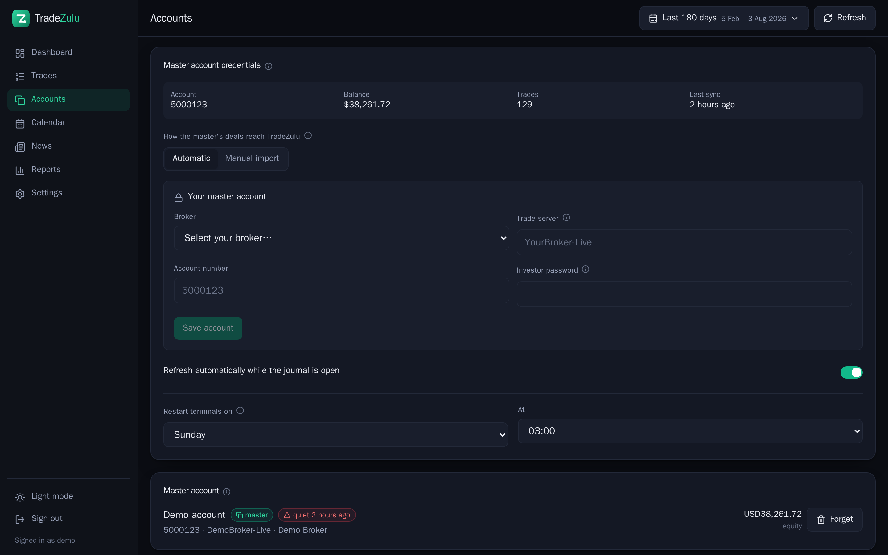

# Screenshots

The dashboard is in the [README](../README.md). Everything else lives here so
the front page stays short.

These are the demo account rather than a real one: `TZ_DEMO=1` fills a
throwaway database with 129 trades over four months, and every figure below is
computed from them by the same code that would compute yours. It is a *good*
four months — a demo of a losing account teaches nothing about the software —
so read the numbers as a shape rather than as a promise.

```bash
docker compose run --rm --service-ports -e TZ_DEMO=1 tradezulu demo
```

## Calendar

Each day carries three things and no more: what it made or lost, that as a
percentage of the balance the day *opened* with, and how many trades it took.
Compounding follows from the second one, so a good day early makes a later day
of the same size a smaller percentage — which is what actually happened to the
account.


## Trades

Every position, with its R multiple, outcome, tags and what it did to the
account. Net ROI is the trade measured against the balance just before it
closed, so the same $700 means less in July than it did in April. Break-evens
get their own colour, because a flat trade is neither a win nor a loss and
lumping it with either distorts the win rate.


## A trade in detail

The chart around the entry, with the real entry, exit, stop and target drawn on
it and an arrow for every fill, so scale-ins and partial exits are visible. The
bars come from the terminal along with the trade, so a chart is available even
for a symbol the account no longer trades.

The terminal collects one timeframe — M5 — and the longer ones are folded out
of it exactly. That is why the buttons start at M5: M1 cannot be built from it,
and inventing it would be interpolation presented as price.


## Reports

Breakdowns by symbol, tag, setup, weekday, hour, hold time and R multiple,
readable in money or in R — or in percentages only, if you would rather share
the page without showing what the account is worth.


## Accounts

The master account's credentials, whether each account's terminal is reporting,
and every slave that follows it. The terminal is provisioned, logged in and
started for you: nothing to install and no paths to configure.



## On a phone

It installs as a PWA. The calendar drops to the figures that matter and the
trade list becomes cards rather than a table you have to pan across.


