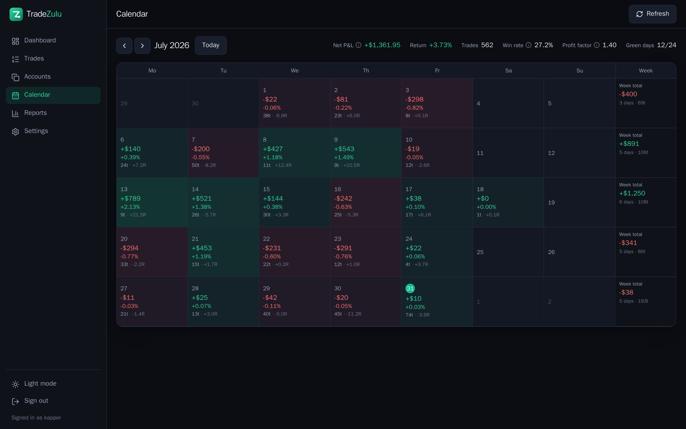
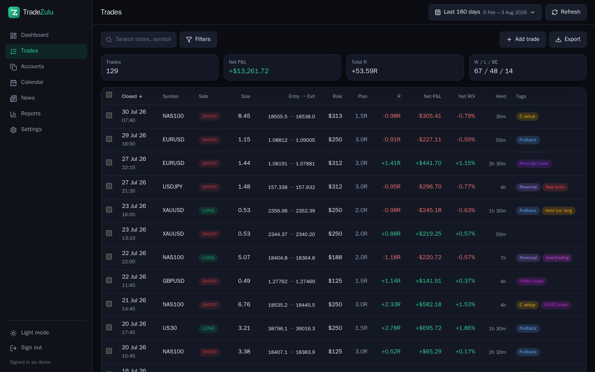
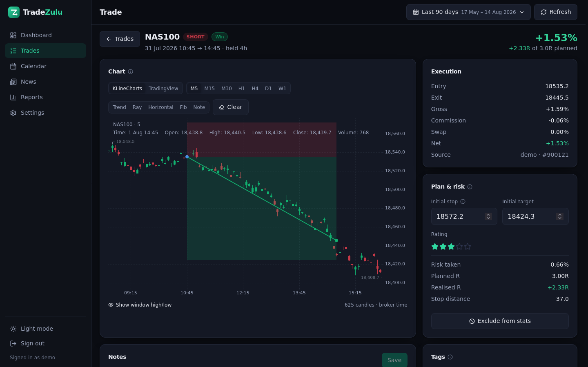
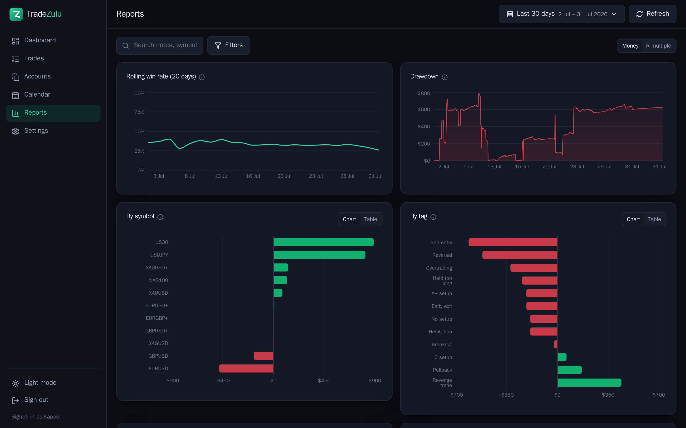
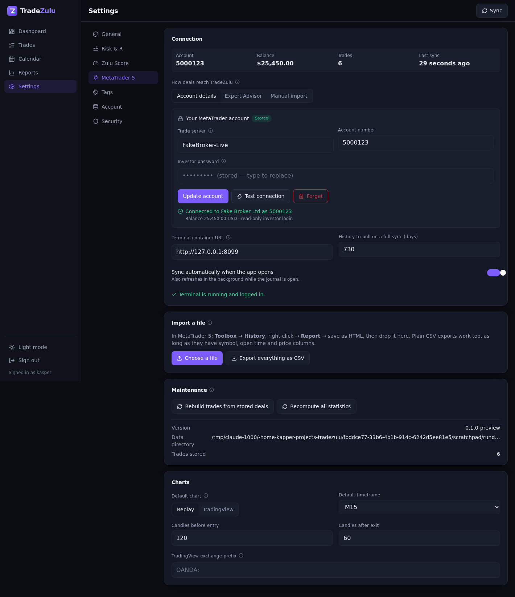
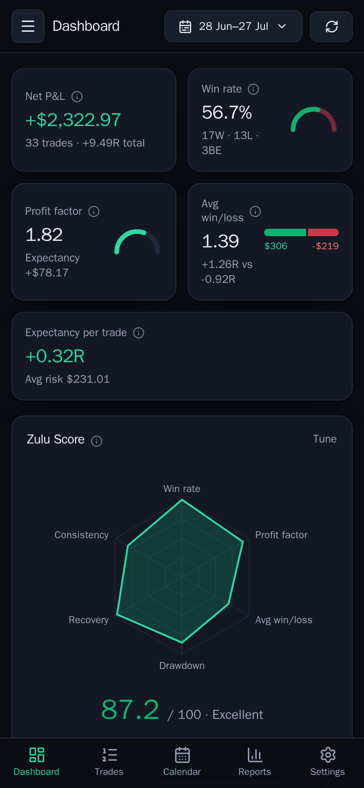

# Screenshots

The dashboard is in the [README](../README.md). Everything else lives here so
the front page stays short.

All of these are a real account — 2,000-odd trades imported from MetaTrader —
rather than seeded data, so the numbers behave the way yours will.

## Calendar

Each day carries what it made or lost, as money and as a percentage of what the
account was worth that morning. Compounding, so a good day early makes a later
day of the same size a smaller percentage — which is what actually happened to
the account.

## Trades

Every position, with its R multiple, outcome and tags. Break-evens get their own
colour, because a flat trade is neither a win nor a loss and lumping it with
either distorts the win rate.

## A trade in detail

The chart around the entry, with the real entry, exit, stop and target drawn on
it and an arrow for every fill, so scale-ins and partial exits are visible. The
bars come from the terminal along with the trade, so a chart is available even
for a symbol the account no longer trades. The terminal collects one timeframe
and the longer ones are folded out of it, which is why the timeframe buttons
only offer what can actually be drawn.

## Reports

Breakdowns by symbol, tag, setup, weekday, hour, hold time and R multiple, each
readable in money, R, or a percentage of the account.

## Connecting MetaTrader

Broker and server are picked from lists, and the terminal is provisioned,
logged in and started for you. Nothing to install and no paths to configure.

## On a phone

It installs as a PWA. The calendar drops to the figures that matter and the
trade list becomes cards rather than a table you have to pan across.

